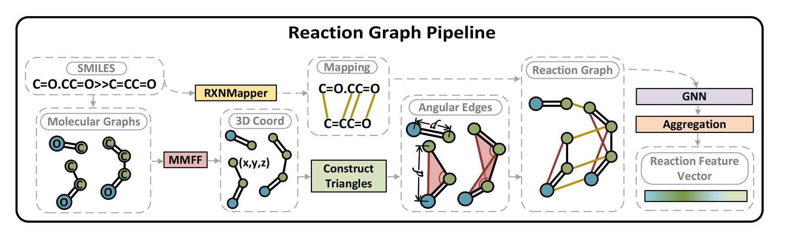

## [ICML 2025] Reaction Graph: Towards Reaction-Level Modeling for Chemical Reactions with 3D Structures

<div align="center">
  💻 <a href="http://molecule-factory.com/"><strong>Website</strong></a> | 
  📃 <a href="https://openreview.net/pdf?id=V6fBMFduGS"><strong>Paper</strong></a> | 
  ⌨ <a href="https://github.com/Shadow-Dream/Reaction-Graph"><strong>Code</strong></a> |
  🥧 <a href="https://huggingface.co/datasets/reactiongraph/ReactionGraph"><strong>Cooked Data</strong></a> | 
  ⛳ <a href="https://huggingface.co/reactiongraph/ReactionGraph"><strong>Checkpoint</strong></a>
</div>

## 👋 Introduction
Chemical reactions happen when atoms rearrange themselves, turning molecules into something new—like making medicines or new materials. But current AI methods still aren't good at guessing how reactions will turn out, including conditions, yields, or reaction types.

We think this is because these AI methods can't easily see how atoms move around or clearly understand molecules' 3D shapes. To fix that, we propose Reaction Graph (RG). RG connects each atom before and after a reaction, clearly showing how they rearrange. It also highlights simple triangles to show the molecules' 3D shapes, which surprisingly helps a lot.

RG can potentially help chemists conduct better research and develop better products. To this end, we provide an [Online Platform](http://molecule-factory.com/) with GUI for reaction analysis — feel free to give it a try! 

## 🛠 Preparation

1. Ubuntu & **CUDA 11.3** & Conda (Windows / WSL require corresponding CUDA versions. Different CUDA versions may cause issues with DGL )

    ```bash
    wget https://developer.download.nvidia.com/compute/cuda/11.3.1/local_installers/cuda_11.3.1_465.19.01_linux.run
    sudo sh cuda_11.3.1_465.19.01_linux.run

    wget https://repo.anaconda.com/miniconda/Miniconda3-latest-Linux-x86_64.sh
    bash Miniconda3-latest-Linux-x86_64.sh
    ```

2. Setting up **Python Environment** (It is strongly recommended to follow the provided bash commands)

    ```bash
    conda create -n rg python=3.9
    conda activate rg

    pip install torch==1.12.1+cu113 torchvision==0.13.1+cu113 torchaudio==0.12.1 --extra-index-url https://download.pytorch.org/whl/cu113
    pip install dgl-cu113 -f https://data.dgl.ai/wheels/repo.html
    pip install rdkit rxnmapper scikit-learn pycm deepmerge
    pip install transformers==4.34.0
    pip install pandas==2.2.3
    pip install numpy==1.26.3
    ```

3. (Not Required for Inference) Download the original and cooked **Data** from [Hugging Face](https://huggingface.co/datasets/reactiongraph/ReactionGraph), and put the files under `datasets` directory
    > Since the files are large, you can selectively download only the parts you need

    ```
    Reaction-Graph/
    ├── analysts
    ├── ......
    ├── dataloaders
    ├── datasets/
    │   ├── hte/
    │   │   ├── buchwald_hartwig
    │   │   └── ......
    │   ├── uspto_condition
    │   ├── uspto_tpl
    │   └── uspto_yield
    ├── encoders
    └── ......
    ```

4. Download the **Model Parameters** from [Hugging Face](https://huggingface.co/reactiongraph/ReactionGraph), and put the files under `checkpoints` directory
    ```
    Reaction-Graph/
    ├── analysts
    ├── checkpoints/
    │   └── reaction_graph/
    │       ├── hte
    │       ├── uspto_condition
    │       ├── uspto_tpl
    │       └── uspto_yield
    ├── dataloaders
    └── ......
    ```
## 🔍 Inference

We provide a series of interfaces for predicting reaction conditions, yields, and reaction types

- **Condition Recommendation Example**
    ```bash
    python inference.py --dataset uspto_condition --reactions "C>>C" "CO>>OC" "CCO>>COC"
    ```
- **Yield Prediction Example**
    ```bash
    python inference.py --dataset uspto_yield --experiment gram --reactions "C>>C" "CO>>OC" "CCO>>COC"
    ```
- **Reaction Classification Example**
    ```bash
    python inference.py --dataset uspto_yield --reactions "C>>C" "CO>>OC" "CCO>>COC"
    ```

> To modify the device used during inference, please update the `device` and `gpu` settings in the corresponding config file. For example, the config file for **Condition Recommendation** is `metadatas/reaction_graph_uspto_condition_config.py`

## 📊 Testing

We provide scripts to run our model on the test dataset. The testing experiments are executed concurrently in the background, and the output results will be saved in the `logs/test` directory


- **USPTO Condition**
    ```bash
    python test.py --dataset uspto_condition
    ```
- **HTE**
    ```bash
    python test.py --dataset hte
    ```
- **USPTO Yield**
    ```bash
    python test.py --dataset uspto_yield
    ```
- **USPTO TPL**
    ```bash
    python test.py --dataset uspto_tpl
    ```

> To modify the experiments during testing, please update the `experiments` settings in the corresponding config file. For example, the config file for **HTE** is `metadatas/reaction_graph_hte_config.py`

## 🚀 Training
1. (Optional) We provide scripts for preprocessing the raw dataset into Reaction Graph data. The preprocessing is executed concurrently in the background, and the outputs will be saved in the `logs/preprocess` and the `datasets` folder. Before preprocessing, please ensure that the raw data files are placed according to the  [File Structure](https://huggingface.co/datasets/reactiongraph/ReactionGraph/tree/main)

    - **USPTO Condition**
        ```bash
        python preprocess.py --dataset uspto_condition
        ```
    - **HTE**
        ```bash
        python preprocess.py --dataset hte
        ```
    - **USPTO Yield**
        ```bash
        python preprocess.py --dataset uspto_yield
        ```
    - **USPTO TPL**
        ```bash
        python preprocess.py --dataset uspto_tpl
        ```

2. We provide scripts for training the model on the provided datasets. The training process is executed concurrently in the background, and the outputs will be saved in the `logs/train` and the `checkpoints` folder

    - **USPTO Condition**
        ```bash
        python train.py --dataset uspto_condition
        ```
    - **HTE**
        ```bash
        python train.py --dataset hte
        ```
    - **USPTO Yield**
        ```bash
        python train.py --dataset uspto_yield
        ```
    - **USPTO TPL**
        ```bash
        python train.py --dataset uspto_tpl
        ```
## 🎨 Customization (In Development)
1. Analyze your dataset by passing all reactions into the `analyst.py` script. This step will return the metadata of the dataset. You can modify the data features as needed and save them in the metadata folder (refer to `metadatas/uspto_condition_metadata.py`)
    ```
    python analyst.py --reactions "C>C" "CO>>CO" "CCO>>COC"
    ```

2. To preprocess the data into Reaction Graph format, you can organize your dataset files according to the structure of existing datasets and perform preprocessing (refer to `preprocess.py`)

3. Specify the model hyperparameters and the preprocessed data location in the config file (refer to `metadatas/reaction_graph_uspto_condition_config.py`), and use the corresponding model (Condition, Yield, or Type) for training (refer to `train.py`).

> The pipeline for customized data fitting is currently under construction. We provide several online fitting service interfaces on our [Website](http://molecule-factory.com/).

## 📜 TODO List:
- [ ] Release python library

- [ ] Customized data fitting

- [x] Code refactoring - Jun 4, 2025

- [x] Release model parameters - Jun 4, 2025

- [x] Release inference code - May 23, 2025

- [x] Release evaluation code - Jun 4, 2025

- [x] Release training code - Jun 4, 2025

## 📝 Citation
If our paper has inspired your research or our code has been helpful in your work, we would greatly appreciate it if you could kindly cite our paper!

<!-- ```bibtex
@inproceedings{jianreaction,
  title={Reaction Graph: Towards Reaction-Level Modeling for Chemical Reactions with 3D Structures},
  author={Jian, Yingzhao and Zhang, Yue and Wei, Ying and Fan, Hehe and Yang, Yi},
  booktitle={Forty-second International Conference on Machine Learning}
}
``` -->
