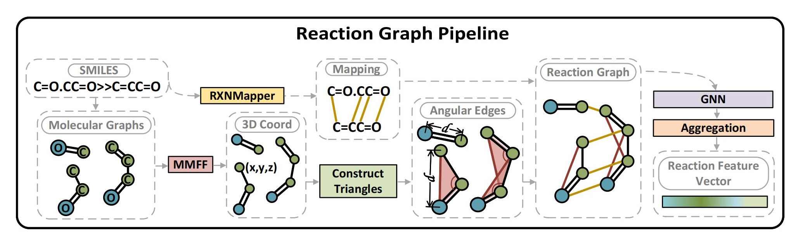

## [ICML 2025] Reaction Graph: Towards Reaction-Level Modeling for Chemical Reactions with 3D Structures

Website: http://molecule-factory.com/

Checkpoints: https://huggingface.co/reactiongraph/ReactionGraph

TODO List: 
- [ ] Code refactoring

- [x] Release model parameters

- [x] Release inference code

- [ ] Release evaluation code

- [ ] Release training code
